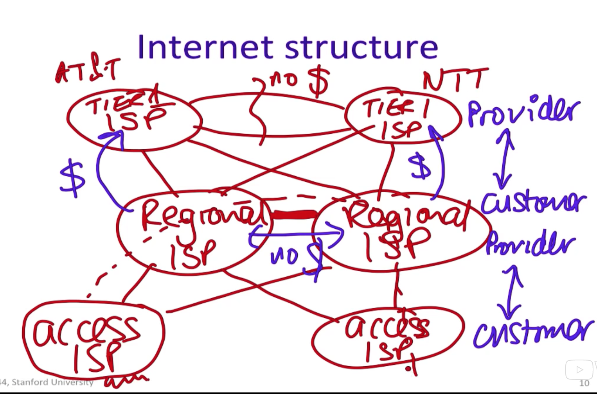
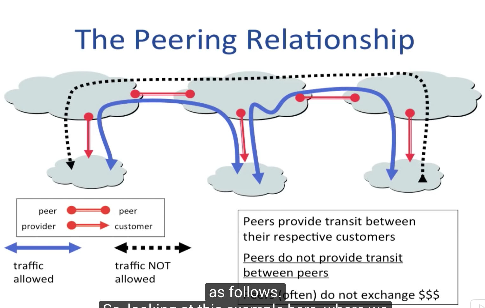

# Unit 6 Routing

## 0. Routing
### Q1: how to get pkt from A to B across large network
- forward and route
- to start
  - packet contains list of routers to pass through (state)
  - **source routing**
  - inefficient & security loophole
- internet uses forwarding table
  - each router
  - for each destination prefix, which next hop to send pkt to
### Q2: how do forwarding tables get populated
- distributed algorithm
- routers build a spanning tree
  - no loop
  - root = destination, leaves are other sources
  - Bellman Ford (distance vector)
  - Dijkstra's algo (link state)
### Autonomous System
- administrative domain of routing within internet
- **within an autonomous system: two basic algos**
  - RIP - distance vector
  - OSPF - link state (people use this one mostly)
- **between autonomous systems: BGP**
  - AS hide internal

## 1. Flooding, source routing and spanning trees
- flooding
  - every pkt will be delivered at least once at the leave
  - maybe loop
  - inefficient
  - use ttl or hop count to stop looping forever
  - simple
    - no state in routers
    - A does not need to know about topology
    - no forwarding tables
  - **used when end host knows nothing about network**
- source routing
  - A knows topology and ordering
  - no forwarding tables
  - pkt carries too many addresses
  - **used when end host wants to control route**
- forwarding table
  - state: destination address -> next hop
  - network takes on the function to optimize it
- spanning tree
- metric
  - choices
    - min distance
    - min hop count
    - min delay
    - max throughput
    - least loaded path
    - most reliable path
    - lowest cost path
    - most secure path
    - ...
- annotated graph
  - node, edge, cost
  - min cost spanning tree
- other types of routing
  - multipath
    - some links could be popular
    - load balancing
  - multicast
    - vs. unicast
    - a host send pkts to a set of hosts
## 2. Bellman Ford
- min cost spanning tree to R8
  - Ri maintains value cost Ci to reach R8
  - vector C = (C1, C2, ..., C7) is the distance vector to R8
  - initially C = (all infinity)
  1. after T seconds, Ri sends Ci to neighbors
  2. if Ri learns lower cost path, update Ci
  3. repeat
- runtime
  - longest loop free path
- problem
  - bad news travels slowly
- fix
  - set infinity = "some small integer" (e.g. 16)
    - stop when count = 16
  - split horizon
    - does not advertise to where it receives from
  - split horizon with poison reverse
    - advertise infinity to where it receives from
## 3. Dijkstra
- Dijkstra's shortest path algo - example of "link state algo"
  1. exchange link state
    - router *floods* to every other router the state of links connected to it
      - periodically
      - when link state changes
      - **every router has a full topology map!!!**
  2. run Dijkstra
    - each router runs Dijkstra
  - in the end each router finds its minimum-cost spanning tree to reach other routers
- run time
  - O(n) (n = # of routers)
- link cost change, or routers/links fail
  - re-calculate from scratch, no worries
- Dijkstra in practice
  - link state known by every router
  - each router calculates for itself
  - basis of OSPF

## 4. Internet (RIP, OSPF) AS's
- hierarchy
  - exterior gateway protocol
  - interior routing protocol
  - single exit or stub AS
  - multi exit or transit AS
- AS
  - basic unit of hierarchy in internet
    - within AS, owner decides routing
    - between AS's, BGP-4
  - find AS number
    - to find AS number for stanford.com:
    1. query DNS to find IP address:
      - `dig stanford.edu`
    2. find AS for IP address:
      - `nc whois.cymru.com 43`
      - enter the IP address of stanford.edu
    - to find AS along the path from my computer to netflix.com
      - `traceroute -a netflix.com`
- interior routing protocols
  - RIP (distance vector)
  - OSPF (link state)
    - updates sent by flooding
    - IS-IS very similar
- routing to a single exit point
  - small forwarding table
- routing to multiple exit points
  - which exit point to use?
  - large forwarding table
  - approach 1: hot-potato - sends to closest exit point
  - approach 2: pick exit closest to destination
- exterior routing protocol
  - BGP-4
  - problems to solve
    - topology
    - autonomy of AS's
    - trust
    - policies
- internet structure

  - provider charges customer
  - **Tier 1** ISP (AT&T, NTT)
    - provider
    - ISP's that are fully mesh interconnected with each other
    - settlement free peering (no charge!)
  - **regional** ISP
    - customer of Tier 1 ISP
    - provider of access ISP
  - **access** ISP
    - customer
    - what users connect to

## 5. BGP
- basics
  - path vector
    - advertise complete path
- peering relationship

  - a peer cannot be a transit for other peers
- BGP messages
  - open
  - keep alive
  - notification
  - update
- BGP route selection summary
  - highest local preference
  - traffic engineering
  - lowest router id

## 6. Multicast
- basics
  - network duplicates -> more efficient
- flooding
  - problem: looping
- reverse path broadcast (RPB)
  - find minimum-spanning tree in opposite direction
  - *pruning*
- multiple trees from difference sources
- addresses and joining a group
  - IPv4: class D IP addresses are for multicasting
  - IGMP (internet group management protocol)
    - between host and directly attached router
    - hosts ask to receive packets belonging to a particular multicast group
    - hosts periodically poll hosts to ask which groups they want
    - no reply -> membership times out (soft-state)
- multicast routing in internet
  - DVMRP
    - distance vector
    - RPB + prune
  - PIM
