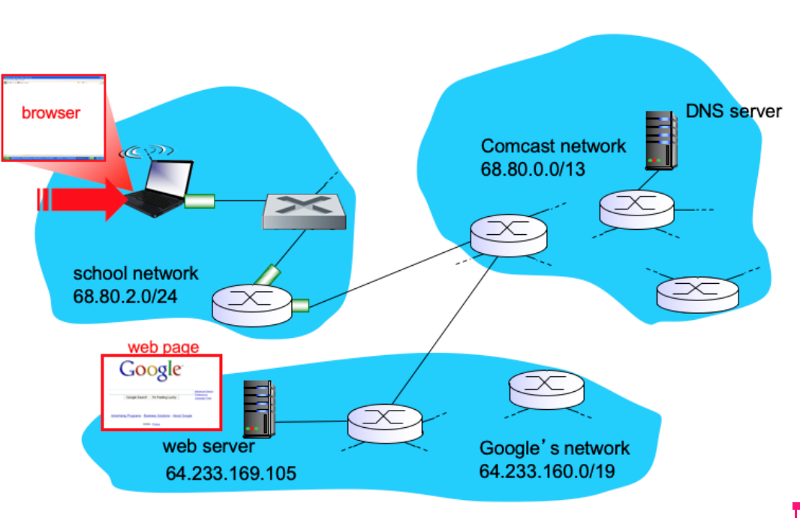

# end-to-end example

End-to-end example

Below is the sequence of things that happened under the hood
- Laptop just connected to the new network, need an IP address before doing anything else. DHCP is a protocol for this.
  - DHCP is an application layer protocol
  - DHCP uses UDP as transport layer protocol, because it needs to do broadcast (no prior knowledge on which network it is on, what’s the IP address of the DHCP server on this network)
    - broadcast IPv4 address is 255.255.255.255
  - UDP is running on top of IP, which is running on top of Ethernet (assuming this laptop is connected by Ethernet cable)
    - destination MAC address will be FF:FF:FF:FF:FF:FF
  - Ethernet frame will go through the switch, which will flood this data frame to all ports (because it has broadcast MAC address).
  - DHCP server (running on the router) will pick up this request
    - The NIC will accept data frame because it has broadcast MAC address, then will strip its header and hand over to IP layer
    - IP layer will strip away its header and hand over to UDP
    - UDP will strip away its header and hand to DHCP server (application process)
  - DHCP server will respond this request with DHCP offer, and follow through the rest of the protocol
  - Once DHCP protocol completes, the laptop will have an IP address to use. It also knows the IP address of the local DNS server, and the IP address of the first hop router.
- Now user wants to access www.google.com and search for homework solutions. The first thing that happens is to resolve domain name. And DNS protocol will be used here.
  - DNS is an application layer protocol
  - DNS (mostly) uses UDP as transport layer protocol, because performance is crucial (the 3-way handshake in TCP cost an extra RTT delay).
  - The IP address used for this DNS request will be the IP address of the local DNS server.
  - The local DNS server is on a different network (Comcast network), so the laptop will send this to the first hop router.
    - meaning, the destination MAC address will be first hop’s MAC address
    - if anytime the destination MAC address is unknown, ARP protocol will be used
  - First hop router will pick up this frame because the destination MAC address matches its own. It will then forward this packet to the Gateway router in Comcast network
    - usually customer network will have a default route configured in the forwarding table (so no BGP protocol is needed here)
  - The gateway router receives the packet with DNS request, it will use the routes learned from intra-domain routing protocol (since the local DNS server is in the same AS) to forward the packet to the local DNS server.
    - intra-domain protocols can be RIP, OSPF, EIGRP, etc.
  - The local DNS server picks up this packet. It will check its cache first for google.com’s IP address (mostly likely yes). If it doesn’t have it, it has to go through the DNS server hierarchy to resolve the domain name.
    - DNS server sends back the response with IP address.
- After domain name is resolved, the browser running on the laptop will send an HTTP GET request to the Google’s web server.
  - HTTP is an application layer protocol
  - HTTP uses TCP protocol for reliable data transfer, because reliability is important for web surfing.
  - Before HTTP can send any application layer data, TCP needs to do the 3-way handshake to setup the connection.
    - SIN packet is sent from laptop to web server, then a SIN + ACK packet is sent from web server to laptop, then another ACK packet is sent from laptop to web server.
  - Every packet for this connection will have the web server’s IP address as the destination IP address.
    - Since web server is in a different network (Google’s network), so it will be sent to the first hop router
    - thus, first hop router’s MAC address will be used as the destination MAC address again
  - First hop router will forward this packet to the gateway router in Comcast network
    - again this is usually done through default route configured in customer network’s router
  - The gateway router in receives this packet, it will lookup the forwarding table
    - because Google’s web server is in a different network than Comcast’s network, it route is learned through running BGP between the gateway routers from Comcast and Google respectively.
    - The gateway router in Comcast network will forward this packet to the gateway router in Google’s network
  - Google’s gateway router receives the packet. Because the web server is in the same network, the gateway router here will use the routes learned from intra-domain routing protocols to forward this packet
  - The web server receives this packet, and the HTTP server will reply back with the home back of www.google.com as an HTTP response.
- After the browser receives the first HTTP response (the HTML page), it will parse through the page and see if there are any other objects to request. If so, additional HTTP requests will be made.
